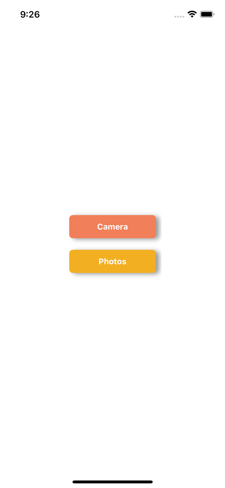
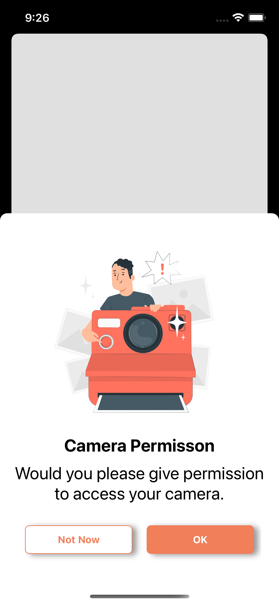
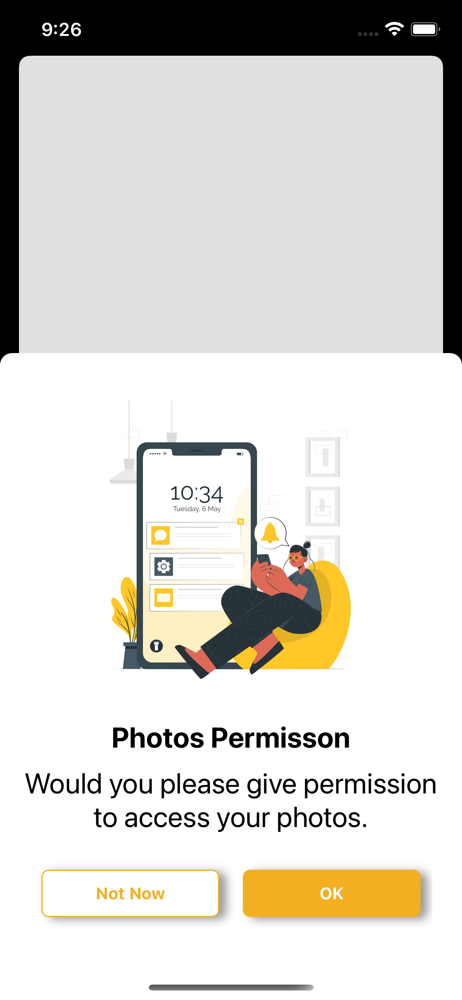

# HW2_EgeSeckin

We build an app that shows the camera and photos permissions. It's made with an programatic coding not with the Storyboard or swiftUI.

Here is the main screen of the app;

Here is the camera permission page;

Here is the photos permssion page;

